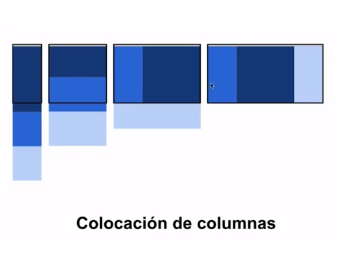

# ¿Qué es Responsive web design?
Son todas las tecnincas que usamos para adaptar nuestras aplicaciones web a la mayor cantidad de pantallas.

## 5 Patrones | Tecnicas de Responsive Design
* Mostly Fluid
* Column Wrap
* 
* 
* 

