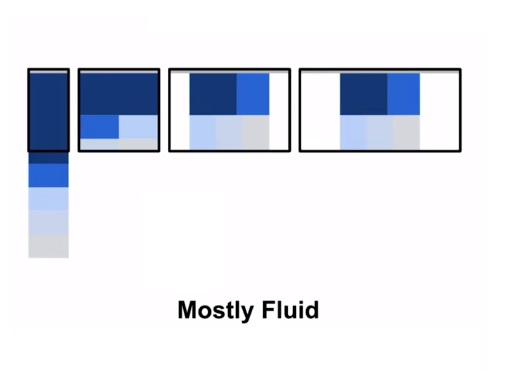
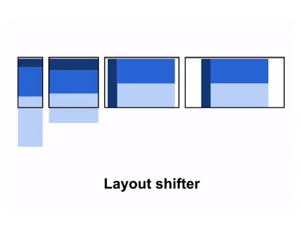
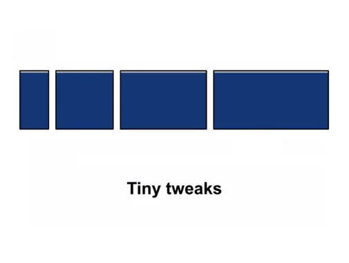
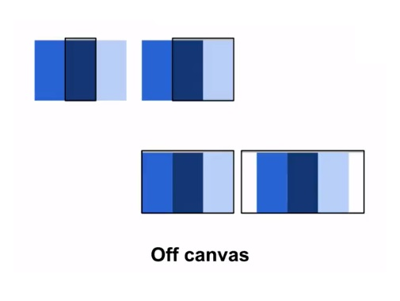
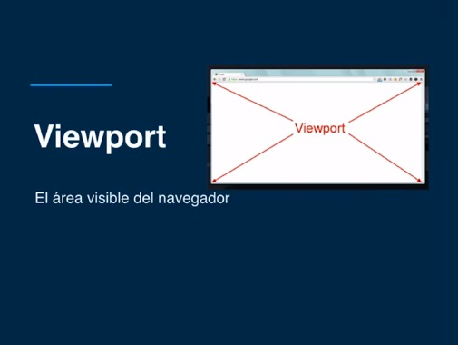
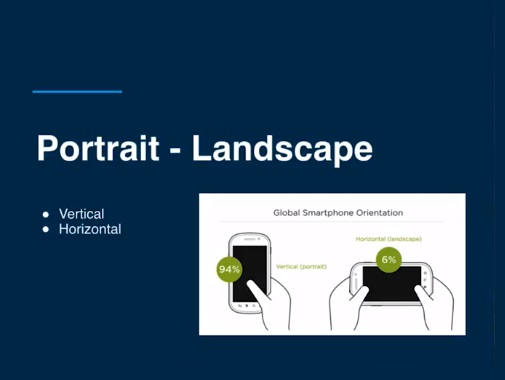
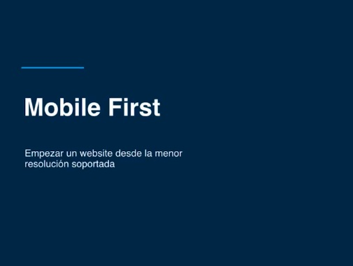
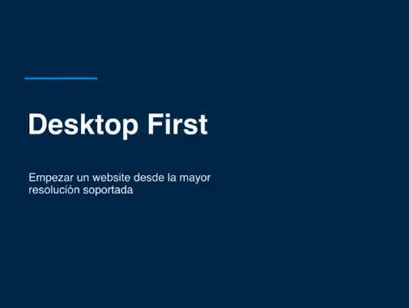

# ¿Qué es Responsive web design?
Son todas las tecnincas que usamos para adaptar nuestras aplicaciones web a la mayor cantidad de pantallas.

## 5 Patrones / Tecnicas de Responsive Design
* Mostly Fluid
* Column Wrap
* Layout Shifter 
* Tiny Tweaks
* Off Canvas

### Mostly Fluid

### Column Wrap

### Layout Shifter

### Tiny Tweaks

### Off Canvas

## Viewport
El viewport es el area visible de tu browser. incluye el scrollbar

## Orientation
Orientacion de la pantalla horizontal - vertical / landscape - portrait

## Metodologias
* Mobile First
* Desktop First
* Content First

### Mobile First

### Desktop First
